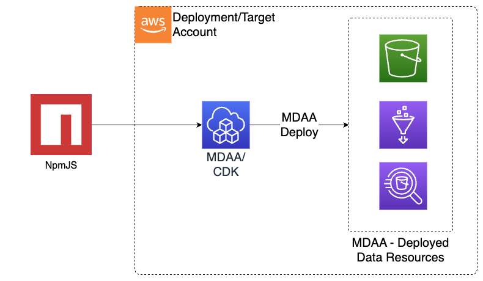
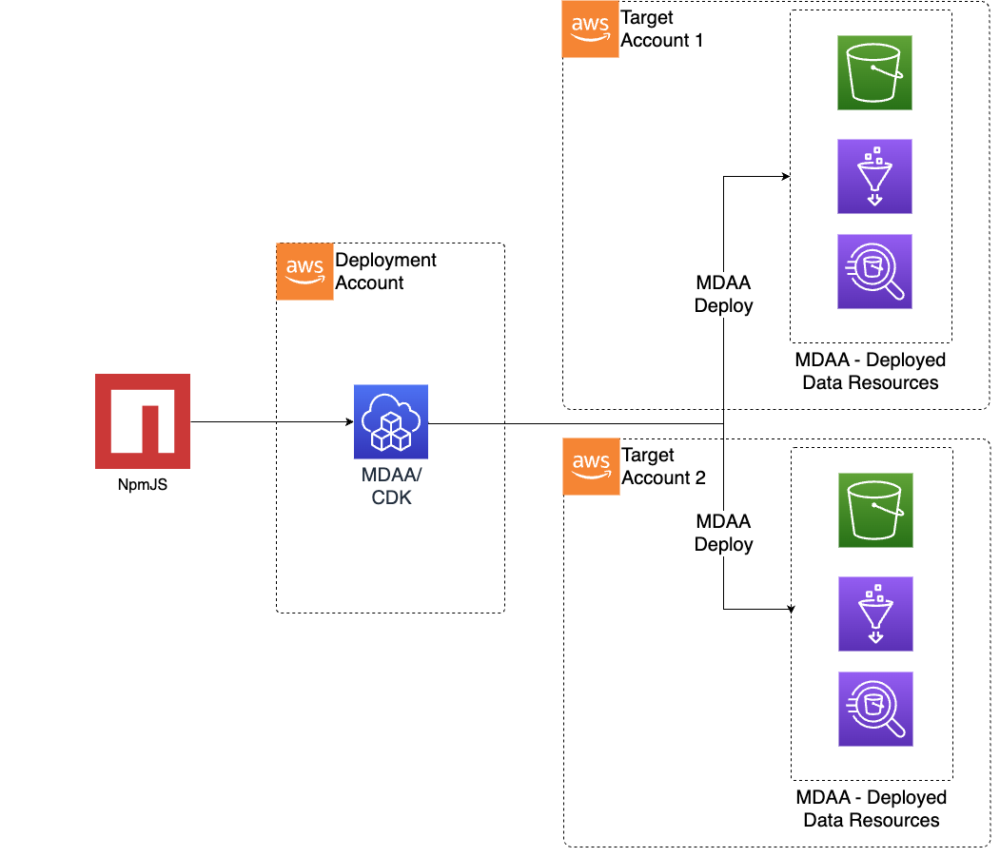

# Deployment Guide

## Overview

This guide walks you through deploying MDAA (Modern Data Architecture Accelerator) modules to your AWS accounts using the MDAA CLI (`npx @aws-mdaa/cli`). It covers environment setup, your first deployment, CLI actions, filtering options, and troubleshooting.

MDAA supports multiple deployment patterns depending on your organization's account structure:

### Same Deployment Source and Target Account (Centralized Data Environment)



### Single Deployment Source, Separate Target Accounts (Centralized Governance, Decentralized Data Environments)



> **Haven't prepared your AWS accounts yet?** Complete the [Predeployment Guide](PREDEPLOYMENT.md) first — it walks you through CDK bootstrapping and account preparation.

---

## Prerequisites

Ensure the following tools are installed before proceeding:

| Tool | Required Version | Installation |
|---|---|---|
| **Node.js** | 22.x | [nodejs.org](https://nodejs.org/) |
| **npm / npx** | 10.x or greater | Included with Node.js. See [npm docs](https://docs.npmjs.com/downloading-and-installing-node-js-and-npm) |
| **Docker** | Latest stable | [docker.com](https://docs.docker.com/get-docker/). Alternatives like [Finch](https://github.com/runfinch/finch) are also supported — set `CDK_DOCKER` to the correct path if using an alternative |
| **Python** | 3.1x | [python.org](https://www.python.org/downloads/). Required for modules that package code assets without Docker |
| **AWS CLI** | 2.x | [AWS CLI install guide](https://docs.aws.amazon.com/cli/latest/userguide/getting-started-install.html) |
| **AWS credentials** | — | Configured via environment variables or `~/.aws/credentials` with permissions to deploy to your target account(s) |

> **Note:** Docker is used by some MDAA modules to build deployable code assets and Docker images. Where Docker is not available, modules fall back to packaging assets directly using pip (Python).

---

## Environment Setup

### 1. Configure AWS Credentials

Ensure your AWS credentials are available either as environment variables or in your `~/.aws/credentials` file:

```bash
export AWS_ACCESS_KEY_ID=<your-access-key>
export AWS_SECRET_ACCESS_KEY=<your-secret-key>
export AWS_SESSION_TOKEN=<your-session-token>   # if using temporary credentials
```

Or configure a named profile in `~/.aws/credentials`:

```ini
[default]
aws_access_key_id = <your-access-key>
aws_secret_access_key = <your-secret-key>
```

### 2. Set Your AWS Region

Specify the target region either as an environment variable or in `~/.aws/config`:

```bash
export AWS_DEFAULT_REGION=us-east-1
```

Or in `~/.aws/config`:

```ini
[default]
region = us-east-1
```

---

## Step-by-Step Deployment

This section walks you through deploying MDAA for the first time. The same steps apply to any starter kit or custom configuration.

### 1. Create Your Configuration

Copy a starter kit to your own directory:

```bash
cp -r starter_kits/basic_datalake ./my-mdaa-project
cd ./my-mdaa-project
```

### 2. Configure

Address all TODOs in `mdaa.yaml` (organization name, context values) and review CDK Nag suppressions in the roles yaml file(s).

### 3. Preview What Will Be Deployed (Optional)

```bash
npx @aws-mdaa/cli list
npx @aws-mdaa/cli synth
npx @aws-mdaa/cli diff
```

### 4. Deploy

```bash
npx @aws-mdaa/cli deploy
```

The Basic DataLake starter kit takes approximately 15–20 minutes to deploy. See [Deployment Time Estimates](#deployment-time-estimates) for other starter kits.

### 5. Verify the Deployment

After deployment completes, confirm that all CloudFormation stacks reached `CREATE_COMPLETE` status:

```bash
aws cloudformation list-stacks \
  --stack-status-filter CREATE_COMPLETE UPDATE_COMPLETE \
  --query "StackSummaries[?contains(StackName, 'mdaa')].[StackName, StackStatus]" \
  --output table
```

You should see your MDAA stacks listed with a successful status.

---

## CLI Actions Reference

The MDAA CLI supports four primary actions. Each action operates on the modules defined in your `mdaa.yaml` configuration file.

| Action | Description | Example Command |
|---|---|---|
| `list` | List all configured stacks in your configuration | `npx @aws-mdaa/cli list -c <path to mdaa.yaml>` |
| `synth` | Synthesize CloudFormation templates without deploying | `npx @aws-mdaa/cli synth -c <path to mdaa.yaml>` |
| `diff` | Show the difference between deployed and pending changes | `npx @aws-mdaa/cli diff -c <path to mdaa.yaml>` |
| `deploy` | Deploy all configured modules to your AWS account(s) | `npx @aws-mdaa/cli deploy -c <path to mdaa.yaml>` |

> **Tip:** Run `list` and `synth` before `deploy` to preview what will be created in your account.

---

## Filtering Options

You can scope any CLI action to a subset of your configuration using filters. Filters work with all actions (`list`, `synth`, `diff`, `deploy`).

### Filter by Environment

Deploy only a specific environment (e.g., `dev`):

```bash
npx @aws-mdaa/cli deploy -c mdaa.yaml -e dev
```

### Filter by Domain

Deploy only specific domains:

```bash
npx @aws-mdaa/cli deploy -c mdaa.yaml -d domain1,domain2
```

### Filter by Module

Deploy only specific modules:

```bash
npx @aws-mdaa/cli deploy -c mdaa.yaml -m test_roles_module,test_datalake_module
```

### Combining Filters

Filters can be combined to narrow the scope further:

```bash
npx @aws-mdaa/cli deploy -c mdaa.yaml -e dev -d domain1 -m test_datalake_module
```

---

## Passing CDK Parameters

Any command-line parameters not recognized by the MDAA CLI are passed through directly to the underlying AWS CDK CLI. This lets you use CDK-specific options alongside MDAA commands.

For example, to deploy without automatic rollback on failure:

```bash
npx @aws-mdaa/cli deploy -c mdaa.yaml --no-rollback
```

Other useful CDK parameters include `--require-approval never`, `--verbose`, and `--profile <profile-name>`. Refer to the [AWS CDK CLI reference](https://docs.aws.amazon.com/cdk/v2/guide/cli.html) for the full list of available options.

---

## Deployment Time Estimates

Deployment times vary based on the number of modules and the complexity of the resources being provisioned. The table below provides approximate times for a first-time deployment of each starter kit.

| Starter Kit | Approximate Modules | Complexity | Estimated Deploy Time |
|---|---|---|---|
| Basic DataLake | ~10 | Low | ~15–20 min |
| Basic DataScience Platform | ~12 | Medium | ~20–30 min |
| DataZone Governed Lakehouse | ~9 | Medium | ~20–25 min |
| GenAI Foundation | ~3 | Medium | ~10–15 min |
| GenAI GAIA Chatbot | ~4 | Medium | ~10–15 min |
| Health Data Accelerator | ~15 | High | ~30–45 min |
| Minimal | ~3 | Low | ~5–10 min |
| MLOps Platform | ~5 | Medium | ~20–30 min |
| SMUS Research Environment | ~6 | Medium | ~20–25 min |
| SMUS Data Mesh | ~10 | High | ~30–45 min |

> **Note:** Times are approximate and depend on your AWS region, account limits, and network conditions. Subsequent deployments (updates) are typically faster since only changed resources are modified.

---

## Verification

After deployment completes, run through these checks to confirm everything deployed successfully.

### Check CloudFormation Stacks

List all MDAA-related stacks and confirm they show `CREATE_COMPLETE` or `UPDATE_COMPLETE`:

```bash
aws cloudformation list-stacks \
  --stack-status-filter CREATE_COMPLETE UPDATE_COMPLETE \
  --query "StackSummaries[?contains(StackName, 'mdaa')].[StackName, StackStatus, CreationTime]" \
  --output table
```

If any stacks show `ROLLBACK_COMPLETE` or `CREATE_FAILED`, see [Troubleshooting](#troubleshooting) below.

### Check Deployed Resources

Verify that key resources were created. For example, list S3 buckets provisioned by MDAA:

```bash
aws s3 ls | grep mdaa
```

For modules that create IAM roles, confirm they exist:

```bash
aws iam list-roles --query "Roles[?contains(RoleName, 'mdaa')].[RoleName]" --output table
```

### Check SSM Parameters

MDAA modules store configuration metadata in AWS Systems Manager Parameter Store. Verify parameters were written:

```bash
aws ssm get-parameters-by-path \
  --path "/mdaa/" \
  --recursive \
  --query "Parameters[*].[Name]" \
  --output table
```

> **Tip:** The specific resources created depend on your starter kit and configuration. Refer to your starter kit's README for details on what to expect.

---

## Account-Level Modules

Some MDAA modules manage AWS resources that are inherently account-scoped — they configure account-wide settings rather than project-specific resources. These are called **account-level modules**:

- **Glue Catalog** (`@aws-mdaa/glue-catalog`) — Account-wide Glue Data Catalog settings and encryption
- **LakeFormation Settings** (`@aws-mdaa/lakeformation-settings`) — Account-wide Lake Formation configuration
- **Macie Session** (`@aws-mdaa/macie-session`) — Account-wide Macie session
- **QuickSight Account** (`@aws-mdaa/quicksight-account`) — Account-wide QuickSight configuration

### Deployment constraint

Each account-level module can only be deployed **once per AWS account**. This is enforced in two ways:

1. **CLI validation** — The MDAA CLI checks your `mdaa.yaml` before deployment and rejects configurations that would deploy the same account-level module to the same account more than once.
2. **SSM parameter lock** — Each account-level module creates an SSM parameter at `/account-module-lock/<module-name>` (e.g., `/account-module-lock/glue-catalog`). If a second deployment attempts to create the same parameter, CloudFormation will fail, preventing the duplicate.

If you need the same account-level settings shared across multiple domains or environments in the same account, deploy the module once and reference it from other modules.

---

## Troubleshooting

### Common Deployment Errors

| Error | Likely Cause | Solution |
|---|---|---|
| `CDKToolkit stack not found` | CDK has not been bootstrapped in the target account/region | Run `npx cdk bootstrap` — see the [Predeployment Guide](PREDEPLOYMENT.md) |
| `Access Denied` or `is not authorized to perform` | Insufficient IAM permissions for the deploying credentials | Verify your AWS credentials have the required permissions for the resources being deployed |
| `Docker daemon is not running` | Docker is required by some modules to build assets | Start Docker (or set `CDK_DOCKER` to an alternative like [Finch](https://github.com/runfinch/finch)) |
| `Resource already exists` | A resource with the same name was previously created outside MDAA | Either remove the conflicting resource or adjust your `mdaa.yaml` configuration to use a different name |
| `Resource already exists` on `/account-module-lock/<module>` SSM parameter | An account-level module (e.g., Glue Catalog, LakeFormation Settings, Macie Session, QuickSight Account) is already deployed to this account by another stack | Account-level modules can only be deployed once per account. Remove the existing deployment first, or share the single deployment across domains. See [Account-Level Modules](#account-level-modules) |
| `Rate exceeded` or throttling errors | AWS API rate limits hit during large deployments | Re-run the deploy command — CDK will skip already-completed stacks and resume where it left off |
| Stack stuck in `ROLLBACK_COMPLETE` | A previous deployment failed and the stack could not be cleaned up | Delete the failed stack manually (`aws cloudformation delete-stack --stack-name <name>`) and redeploy |

### Debugging Tips

- Use `npx @aws-mdaa/cli synth -c mdaa.yaml` to generate CloudFormation templates locally and inspect them before deploying.
- Add `--verbose` to any CLI command for detailed CDK output.
- Use `npx @aws-mdaa/cli diff -c mdaa.yaml` to see exactly what changes will be applied before deploying.
- Check CloudFormation events for a failed stack to identify the specific resource that caused the failure:

```bash
aws cloudformation describe-stack-events \
  --stack-name <failed-stack-name> \
  --query "StackEvents[?ResourceStatus=='CREATE_FAILED'].[LogicalResourceId, ResourceStatusReason]" \
  --output table
```

---

## Starter Kit Details

Each starter kit provides a preconfigured `mdaa.yaml` for a common use case. Refer to the individual READMEs for kit-specific configuration options, architecture details, and resource descriptions.

| Starter Kit | Description | README |
|---|---|---|
| **Basic DataLake** | Foundational data lake with S3 storage, Glue catalog, and Athena query access | [README](starter_kits/basic_datalake/README.md) |
| **Basic DataScience Platform** | Data science environment with SageMaker notebooks and shared data access | [README](starter_kits/basic_datascience_platform/README.md) |
| **DataZone Governed Lakehouse** | Lake Formation–governed lakehouse with fine-grained access controls | [README](starter_kits/datazone_governed_lakehouse/README.md) |
| **GenAI Foundation** | Bedrock Agent with RAG and knowledge bases | [README](starter_kits/genai_foundation/README.md) |
| **GenAI GAIA Chatbot** | RAG chatbot backend with document search, auth, and streaming API | [README](starter_kits/genai_gaia_chatbot/README.md) |
| **Health Data Accelerator** | Healthcare-focused data platform with compliance-oriented configurations | [README](starter_kits/health_data_accelerator/README.md) |
| **Minimal** | Base governance layer — starting point for custom configurations | [README](starter_kits/minimal/README.md) |
| **MLOps Platform** | Automated train → deploy → monitor pipeline for ML models | [README](starter_kits/mlops_platform/README.md) |
| **SMUS Research Environment** | SageMaker Unified Studio for team-based research | [README](starter_kits/smus_research_environment/README.md) |
| **SMUS Data Mesh** | Multi-account SageMaker Unified Studio with cross-account data sharing | [README](starter_kits/smus_data_mesh/README.md) |

> See [Deployment Time Estimates](#deployment-time-estimates) for approximate deployment times per kit.

---

## Additional Resources

- [Predeployment Guide](PREDEPLOYMENT.md) — AWS account preparation and CDK bootstrapping
- [README](README.md) — Project overview, quick start, and navigation hub
- [Configuration Guide](CONFIGURATION.md) — How to write and customize `mdaa.yaml` configuration files
- [Architectures Guide](ARCHITECTURES.md) — Supported deployment architectures and patterns
- [Implementation Guide](https://docs.aws.amazon.com/solutions/latest/modern-data-architecture-accelerator/solution-overview.html) — Full external implementation guide on AWS Docs

---

## Advanced: Direct CDK CLI Deployment

> **For contributors and developers only.** This section requires cloning the MDAA source repository. Most users should use `npx @aws-mdaa/cli` or `npm install -g @aws-mdaa/cli` as described above.

For development and troubleshooting, you can deploy individual MDAA modules directly using the CDK CLI instead of the MDAA CLI wrapper. This is useful when working directly against the MDAA codebase.

### Steps

1. Clone the MDAA repo and install dependencies:

```bash
git clone https://github.com/aws/modern-data-architecture-accelerator.git
npm install
```

2. Navigate to the module's source directory (typically under `packages/apps/<module_category>/<module>`).

3. Run CDK commands with the required context parameters:

```bash
cdk synth \
  -c org=<organization> \
  -c env=<dev|test|prod> \
  -c domain=<domain_name> \
  -c app_configs=<app_config_paths> \
  -c tag_configs=<tag_config_paths> \
  -c module_name=<module_name>
```

Example:

```bash
cdk synth \
  -c org="sample-org" \
  -c env="dev" \
  -c domain="mdaa1" \
  -c app_configs="warehouse.yaml" \
  -c tag_configs="tags.yaml" \
  -c module_name="testing"
```

### Required Context Parameters

| Parameter | Description |
|---|---|
| `org` | Organization name |
| `env` | Target environment (`dev`, `test`, `prod`) |
| `domain` | Deployment domain — allows multiple deployments in the same org/env/account |
| `module_name` | MDAA module name — allows multiple deployments of the same CDK app |
| `app_configs` | Comma-separated paths to app config files (later files take precedence) |
| `tag_configs` | Comma-separated paths to tag config files (later files take precedence) |

> **Note:** Additional context values may be required if referenced from within the module's app config. Replace all CDK commands (`synth`, `diff`, `deploy`, `list`) as needed.
