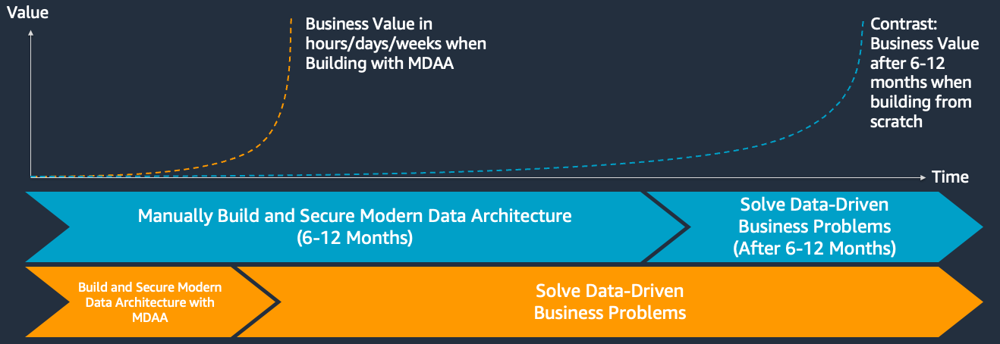
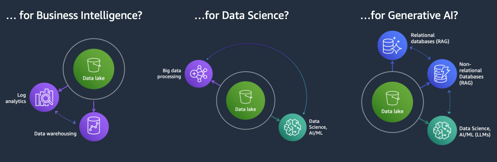
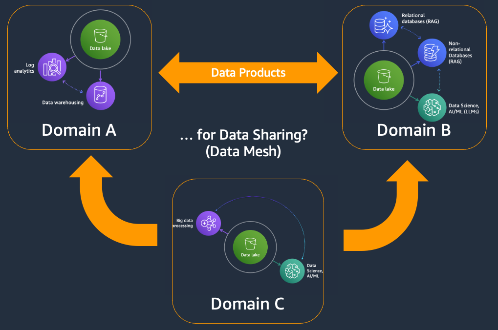
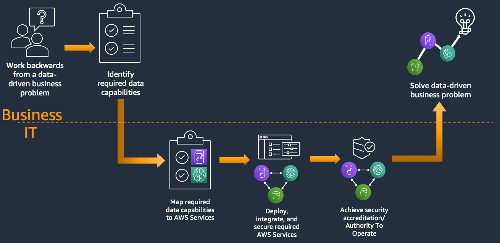
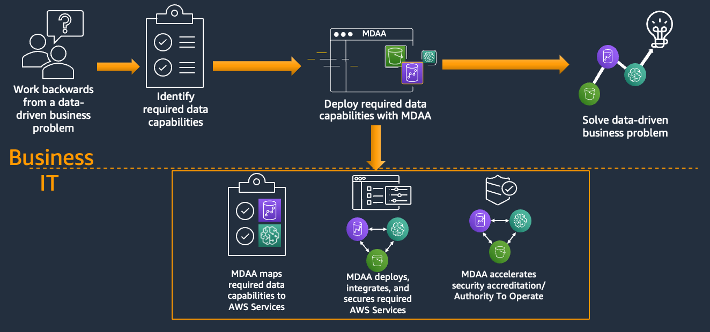
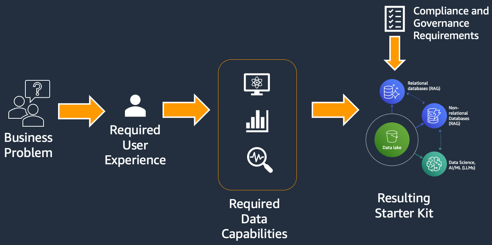
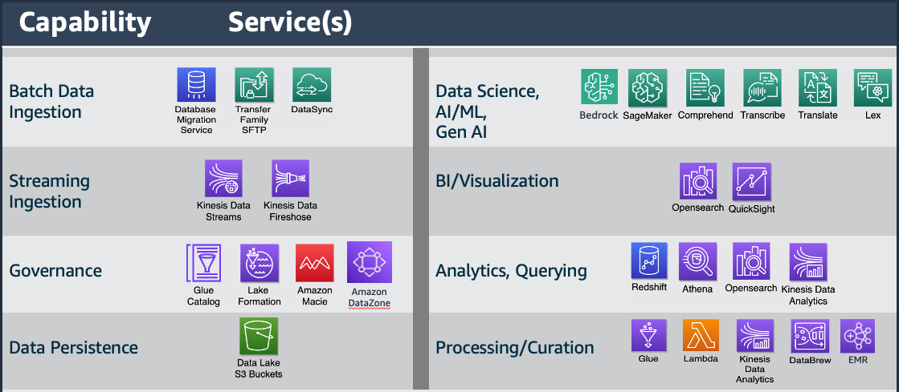

# Modern Data Architecture Accelerator (MDAA)


**Note:** All documentation in this repo is available as rendered/searchable HTML [here](https://aws.github.io/modern-data-architecture-accelerator/).

The Modern Data Architecture Accelerator (MDAA) deploys secure, compliant modern Data and AI architectures on AWS in minutes. Pick a starter kit, fill in your environment details, and deploy — MDAA handles security compliance, encryption, and IAM best practices automatically.

## Table of Contents

- [Why MDAA](#why-mdaa)
- [Uses](#uses)
- [Key Features](#key-features)
- [Quick Start](#quick-start)
- [Available Modules](#available-modules)
- [Security](#security)
- [Workshops and Learning Resources](#workshops-and-learning-resources)
- [Using and Extending MDAA](#using-and-extending-mdaa)
- [For Developers](#for-developers)
- [Contributing](#contributing)
- [License](#license)

## Why MDAA

Building a secure, compliant data and AI platform on AWS typically takes months of architecture design, security reviews, and infrastructure coding. MDAA compresses that into minutes. You get production-ready infrastructure that passes compliance audits on day one — not after weeks of remediation.

- **Minutes, not months**: Deploy a complete data lake, ML platform, or GenAI backend in 15–45 minutes instead of building from scratch.
- **Compliance without compromise**: Every module enforces encryption, least-privilege IAM, and audit logging by default. No shortcuts, no security debt.
- **Focus on your problem, not plumbing**: Spend time on data, models, and business logic — not on writing CloudFormation, debugging IAM policies, or passing security reviews.



## Uses

MDAA can be used to build an architecture to solve any variety of data or AI problem, including:



Additionally, MDAA can be used to build complex, multi-domain and multi-account data and AI architectures:



## Key Features

- **Deploy in minutes, not months**: Starter kits go from zero to a working environment in 15–45 minutes. No custom code required.
- **Security and compliance built in**: All modules enforce encryption, least-privilege IAM, and audit logging. Validated against AWS Solutions, NIST 800-53, HIPAA, and PCI-DSS rulesets.
- **Configuration-driven**: Define your environment in YAML files. Change what you need, leave the rest as secure defaults.
- **Extend as you grow**: Start with a kit, then add modules for analytics, AI, governance, or data pipelines as your needs evolve.
- **Multi-account and multi-region**: Deploy across accounts and regions with built-in cross-account trust.

| Without MDAA | With MDAA |
|---|---|
|  |  |

## Quick Start

### Prerequisites

- [Node.js 22.x](https://nodejs.org/) and [npm 10.x](https://docs.npmjs.com/downloading-and-installing-node-js-and-npm)
- AWS credentials configured with appropriate permissions ([AWS CLI setup](https://docs.aws.amazon.com/cli/latest/userguide/getting-started-install.html))

### 1. Pick a Starter Kit

Start by identifying the business problem you need to solve, then select the starter kit that provides the best coverage of required capabilities. Starter kits are just starting points — deploy as-is or modify and extend with additional [modules](#available-modules) and configurations to match your requirements. If necessary, MDAA deployments can be further customized through [code-level escape hatches](CUSTOMIZATION.md).



| Starter Kit | What you get | Est. Deploy Time |
|---|---|---|
| [Minimal](starter_kits/minimal/README.md) | IAM roles, Glue Catalog encryption, LakeFormation settings — build from scratch | ~5–10 min |
| [GenAI Foundation](starter_kits/genai_foundation/README.md) | Enterprise-ready Bedrock Agent with RAG and knowledge bases | ~10–15 min |
| [GenAI GAIA Chatbot](starter_kits/genai_gaia_chatbot/README.md) | RAG chatbot backend with document search, auth, and streaming API | ~10–15 min |
| [Basic DataLake](starter_kits/basic_datalake/README.md) | Encrypted S3 storage, data catalog, SQL queries, audit trail | ~15–20 min |
| [Basic DataScience Platform](starter_kits/basic_datascience_platform/README.md) | Notebook environment with shared data lake and team isolation | ~20–30 min |
| [MLOps Platform](starter_kits/mlops_platform/README.md) | Automated train → deploy → monitor pipeline for ML models | ~20–30 min |
| [DataZone Governed Lakehouse](starter_kits/datazone_governed_lakehouse/README.md) | Data lake with row/column-level security and a data product catalog | ~20–25 min |
| [SMUS Research Environment](starter_kits/smus_research_environment/README.md) | Self-service ML platform for multiple research teams | ~20–25 min |
| [Health Data Accelerator](starter_kits/health_data_accelerator/README.md) | Automated pipeline from source databases to a curated data lake | ~30–45 min |
| [SMUS Data Mesh](starter_kits/smus_data_mesh/README.md) | Multi-account data platform with cross-team data sharing | ~30–45 min |

### 2. Copy the starter kit configs to your own directory:

Copy the contents of your chosen starter kit from `starter_kits/<kit-name>/` into your own project directory. These are plain YAML files — no build tools or dependencies required.

```bash
cp -r starter_kits/basic_datalake ./my-project
cd ./my-project
```

Address the `# TODO:` comments in the config files (org name, account details, CDK Nag suppressions).

### 3. Follow the starter kit's README

Each kit includes a Deployment section with prerequisites, configuration steps, and deploy commands. See the [starter kit's README](#1-pick-a-starter-kit) for details (README will also be in the created starter config directory).

For general deployment guidance, see [PREDEPLOYMENT](PREDEPLOYMENT.md) and [DEPLOYMENT](DEPLOYMENT.md).

### 4. Use and extend

Once deployed, start using your new architecture (see the kit's USAGE.md) or enhance it with additional capabilities from the [available modules](#available-modules).

## Available Modules

MDAA includes 40+ modules for governance, data lakes, pipelines, analytics, AI, and utilities. Browse the full list with documentation at [aws.github.io/modern-data-architecture-accelerator](https://aws.github.io/modern-data-architecture-accelerator/).



<details>
<summary>Governance Modules</summary>

- [**SageMaker Unified Studio**](packages/apps/governance/sagemaker-app/README.md) - Deploy SageMaker Unified Studio domains and associated resources.
- [**DataZone**](packages/apps/governance/datazone-app/README.md) - Deploy DataZone domains and environment blueprints.
- [**Macie Session**](packages/apps/governance/macie-session-app/README.md) - Deploy Macie sessions at the account level.
- [**LakeFormation Data Lake Settings**](packages/apps/governance/lakeformation-settings-app/README.md) - Administer LakeFormation settings using IaC.
- [**LakeFormation Access Controls**](packages/apps/governance/lakeformation-access-control-app/README.md) - Administer LakeFormation access controls using IaC.
- [**Glue Catalog**](packages/apps/governance/glue-catalog-app/README.md) - Configure Glue Catalog encryption and cross-account access.
- [**IAM Roles and Policies**](packages/apps/governance/roles-app/README.md) - Generate IAM roles for the data and AI environment.
- [**Audit**](packages/apps/governance/audit-app/README.md) - Generate audit resources for data capture and Athena querying.
- [**Audit Trail**](packages/apps/governance/audit-trail-app/README.md) - Generate CloudTrail for S3 data events.
- [**Service Catalog**](packages/apps/governance/service-catalog-app/README.md) - Deploy Service Catalog portfolios and grant access.
- [**SageMaker Projects**](packages/apps/governance/sagemaker-project-app/README.md) - Deploy SageMaker Unified Studio projects and associated resources.

</details>

<details>
<summary>Data Lake Modules</summary>

- [**Datalake KMS and Buckets**](packages/apps/datalake/datalake-app/README.md) - Generate encrypted data lake buckets with compliant policies.
- [**Athena Workgroup**](packages/apps/datalake/athena-workgroup-app/README.md) - Generate Athena workgroups for data lake querying.

</details>

<details>
<summary>Data Ops Modules</summary>

- [**Data Ops Project**](packages/apps/dataops/dataops-project-app/README.md) - Shared secure resources for data ops pipelines.
- [**Data Ops Crawlers**](packages/apps/dataops/dataops-crawler-app/README.md) - Glue crawlers for data ops pipelines.
- [**Data Ops Jobs**](packages/apps/dataops/dataops-job-app/README.md) - Glue jobs for data ops pipelines.
- [**Data Ops Workflows**](packages/apps/dataops/dataops-workflow-app/README.md) - Glue workflows for orchestrating pipelines.
- [**Data Ops Step Functions**](packages/apps/dataops/dataops-stepfunction-app/README.md) - Step Functions for pipeline orchestration.
- [**Data Ops Lambda**](packages/apps/dataops/dataops-lambda-app/README.md) - Lambda functions for data event processing.
- [**Data Ops DataBrew**](packages/apps/dataops/dataops-databrew-app/README.md) - Glue DataBrew for data profiling and cleansing.
- [**Data Ops Nifi**](packages/apps/dataops/dataops-nifi-app/README.md) - Apache Nifi clusters for event-driven data flows.
- [**Data Ops DMS**](packages/apps/dataops/dataops-dms-app/README.md) - DMS replication instances, endpoints, and tasks.
- [**Data Ops Dashboard**](packages/apps/dataops/dataops-dashboard-app/README.md) - CloudWatch dashboards for MDAA observability.
- [**Data Ops Data Quality**](packages/apps/dataops/dataops-data-quality-app/README.md) - Glue Data Quality rulesets for automated data validation.
- [**Data Ops DynamoDB**](packages/apps/dataops/dataops-dynamodb-app/README.md) - DynamoDB tables for data operations.
- [**Data Ops Aurora**](packages/apps/dataops/dataops-aurora-app/README.md) - Aurora Serverless v2 clusters for relational database workloads.

</details>

<details>
<summary>Data Analytics Modules</summary>

- [**Redshift Data Warehouse**](packages/apps/analytics/datawarehouse-app/README.md) - Secure Redshift data warehouse clusters.
- [**OpenSearch Domain**](packages/apps/analytics/opensearch-app/README.md) - Secure OpenSearch domains and dashboards.
- [**QuickSight Account**](packages/apps/analytics/quicksight-account-app/README.md) - Deploy QuickSight account resources.
- [**QuickSight Namespace**](packages/apps/analytics/quicksight-namespace-app/README.md) - QuickSight namespaces for multi-tenancy.
- [**QuickSight Project**](packages/apps/analytics/quicksight-project-app/README.md) - QuickSight shared folders and permissions.

</details>

<details>
<summary>AI / Data Science Modules</summary>

- [**SageMaker Unified Studio**](packages/apps/ai/sm-studio-domain-app/README.md) - Secured SageMaker Unified Studio.
- [**SageMaker Notebooks**](packages/apps/ai/sm-notebook-app/README.md) - Secured SageMaker notebooks.
- [**Data Science Team/Project**](packages/apps/ai/data-science-team-app/README.md) - Resources for team data science activities.
- [**Generative AI Accelerator**](packages/apps/ai/gaia-v2-app/README.md) - Authenticated GenAI chatbot with WebSocket streaming, Bedrock Knowledge Base RAG, and admin and client UIs.
- [**Generative AI Accelerator v1 (deprecated)**](packages/apps/ai/gaia-app/README.md) - Previous generation of the GenAI chatbot. New deployments should use `@aws-mdaa/gaia-v2`; v1 remains published for existing deployments and will be removed in a future release. See the [migration guide](packages/apps/ai/gaia-app/MIGRATION_TO_V2.md).
- [**SageMaker Ground Truth**](packages/apps/ai/sagemaker-ground-truth-app/README.md) - Automated continuous data labeling pipeline with Ground Truth and Feature Store integration.
- [**SageMaker MLOps**](packages/apps/ai/sagemaker-mlops-app/README.md) - Unified ML training and deployment pipeline with cross-account model promotion.
- [**SageMaker Pipeline**](packages/apps/ai/sagemaker-pipeline-app/README.md) - Declarative SageMaker Pipeline defined in CDK/CloudFormation with no seed code required.
- [**SageMaker Endpoint**](packages/apps/ai/sagemaker-endpoint-app/README.md) - Real-time SageMaker inference endpoint from an approved model package.
- [**SageMaker Model Monitoring**](packages/apps/ai/sagemaker-model-monitoring-app/README.md) - Continuous monitoring of production inference endpoints for drift, degradation, and bias.
- [**Bedrock AgentCore Runtime**](packages/apps/ai/bedrock-agentcore-runtime-app/README.md) - Deploy Amazon Bedrock AgentCore Runtimes with custom Docker containers.
- [**Bedrock Builder**](packages/apps/ai/bedrock-builder-app/README.md) - Deploy secure Bedrock Agents, Knowledge Bases, and associated resources.
- [**Bedrock Settings**](packages/apps/ai/bedrock-settings-app/README.md) - Configure Bedrock model invocation audit logging to S3 and CloudWatch.

</details>

<details>
<summary>Core / Utility Modules</summary>

- [**EC2**](packages/apps/utility/ec2-app/README.md) - Secure EC2 instances and security groups.
- [**SFTP Transfer Family Server**](packages/apps/utility/sftp-server-app/README.md) - SFTP Transfer Family for data lake ingestion.
- [**SFTP Transfer Family User Admin**](packages/apps/utility/sftp-users-app/README.md) - Administer SFTP Transfer Family users.
- [**DataSync**](packages/apps/utility/datasync-app/README.md) - DataSync for on-premises to cloud data movement.
- [**EventBridge**](packages/apps/utility/eventbridge-app/README.md) - EventBridge resources such as event buses.
- [**Machine to Machine API**](packages/apps/utility/m2m-api-app/README.md) - REST API for programmatic data lake interaction.

</details>

## Security

See [SECURITY.md](SECURITY.md) for details on MDAA's security design principles and compliance approach.

See [CONTRIBUTING.md](CONTRIBUTING.md#security-issue-notifications) for information on reporting security issues.

## Workshops and Learning Resources

### Self-Paced Workshops

- [MDAA Hands-On Workshop](https://catalog.us-east-1.prod.workshops.aws/workshops/6e7289c7-5662-494d-8b56-b8706412c3a6): A guided, hands-on workshop that walks you through deploying and configuring MDAA from scratch.

### Documentation

Browse the full documentation, module references, and configuration schemas at [aws.github.io/modern-data-architecture-accelerator](https://aws.github.io/modern-data-architecture-accelerator/).

- [Architecture and Design Guide](ARCHITECTURES.md): Reference architectures and design patterns for MDAA deployments.
- [Configuration Guide](CONFIGURATION.md): How to author MDAA YAML configuration files.
- [Customization Guide](CUSTOMIZATION.md): How to extend MDAA modules with code-based escape hatches.
- [Predeployment Guide](PREDEPLOYMENT.md): How to prepare your AWS accounts for MDAA deployment.
- [Deployment Guide](DEPLOYMENT.md): Step-by-step deployment instructions using the MDAA CLI.

## Using and Extending MDAA

MDAA can be used and extended in three ways:

### Configuration-Driven Deployment

Deploy compliant, end-to-end data and AI environments using YAML config files and the MDAA CLI. No code required - accessible to all roles, from simple to complex deployments with high compliance assurance.

### Code-Driven Custom Environments

Build custom data and AI environments using MDAA's reusable CDK constructs. Multi-language support (TypeScript, Python, Java, .NET) for L2 constructs; L3 constructs are currently TypeScript-only.

### Workload Integration

Independently developed workloads (CDK or CloudFormation) can leverage MDAA-deployed resources via the standard set of SSM (Systems Manager) parameters published by all MDAA modules.


### Metrics Collection

This solution collects anonymous operational metrics to help AWS improve quality and features. For more information, including how to disable this capability, see the [CDK version reporting documentation](https://docs.aws.amazon.com/cdk/latest/guide/cli.html#version_reporting).

## For Developers

For detailed guides, see:

- [CONTRIBUTING.md](CONTRIBUTING.md) - Project architecture, coding guidelines, and pull request process.
- [DEVELOPMENT.md](DEVELOPMENT.md) - Development environment setup, build process, and tooling.
- [TESTING.md](TESTING.md) - Testing standards, architecture, and coverage requirements.

Full documentation and module reference is available at [aws.github.io/modern-data-architecture-accelerator](https://aws.github.io/modern-data-architecture-accelerator/). To generate the docs locally, run `mkdocs serve` from the project root (requires [MkDocs](https://www.mkdocs.org/)).

## Contributing

We welcome contributions from the community. See [CONTRIBUTING.md](CONTRIBUTING.md) for guidelines on how to get started, set up your development environment, and submit pull requests.

## License

This project is licensed under the Apache-2.0 License.
