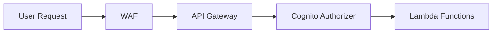
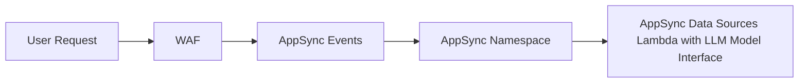

# GenAI Accelerator

The GenAI Accelerator is a comprehensive, enterprise-ready solution for rapidly deploying production-grade Generative AI applications on AWS. Built as part of the Modern Data Architecture Accelerator (MDAA) ecosystem, it provides organizations with a secure, scalable, and compliant foundation for implementing GenAI capabilities without the complexity of building from scratch.

## Architecture Overview

The GenAI Accelerator follows a modern, event-driven serverless architecture designed for scalability, security, and cost optimization. The system is built around three core interaction patterns: real-time chat via WebSocket, RESTful API operations, and asynchronous document processing.

### High-Level Architecture


The architecture consists of four main layers:

1. **Presentation Layer**: Client and Admin UIs with CloudFront distribution
2. **API Layer**: REST and WebSocket APIs with WAF protection and Cognito authentication
3. **Processing Layer**: Lambda functions
4. **Data Layer**: DynamoDB tables, S3 buckets, and optional RAG engines (e.g., Aurora PgVector/OpenSearch)

### Deployed Resources and Compliance Details

The GenAI Accelerator deploys a comprehensive set of AWS resources organized into logical categories. The following sections detail each component's purpose, functionality, and dependencies.

### Core Components

These are the essential components deployed in every GenAI Accelerator installation:

#### API Infrastructure
* **Amazon API Gateway (REST API)** - RESTful API for CRUD operations for chat history and feedback collection. 
* **AWS AppSync Event API** - GraphQL-based event API that orchestrates WebSocket message routing and real-time subscriptions between clients and AI model interfaces.

#### Authentication and Security
* **Amazon Cognito User Pool** - User authentication and management supporting multiple authentication flows including email/password, SAML federation with Active Directory, and integration with existing user pools.
* **Amazon Cognito User Pool Client** - Application client configuration for OAuth flows, callback URLs, and authentication settings.
* **AWS KMS Customer Managed Key** - Stack-wide encryption key for all data at rest and in transit with fine-grained access control policies.
* **AWS Secrets** - Secure storage for sensitive configuration including database credentials, API keys, and security tokens.

#### Data Storage
* **Amazon DynamoDB - Sessions Table** - Stores chat message history, and conversation metadata with configurable retention policies.
* **Amazon DynamoDB - Feedback Table** - Captures user feedback, ratings, and analytics data for AI responses.

#### Lambda Functions
* **REST API Handler** - Processes all REST API requests for chat history and feedback collection.
* **WebSocket Connection Handler** - Manages WebSocket connection lifecycle.

#### AI Model Integration
* **Amazon Bedrock Integration** - Native integration with foundation models including Claude, Jurassic, Cohere, Mistral, and Titan models.

#### UI Hosting Infrastructure
* **Client UI S3 Bucket & CloudFront Distribution** - S3 bucket and CloudFront distribution provisioned for hosting a client-facing web application. No UI is included with MDAA; this infrastructure is ready for deployment of your own custom UI.

* **Admin UI S3 Bucket & CloudFront Distribution** - S3 bucket and CloudFront distribution provisioned for hosting an administrative dashboard. No UI is included with MDAA; this infrastructure is ready for deployment of your own custom UI.

### Optional Components

These components are deployed based on configuration and feature requirements:

* **Regional WAF** - Protects API Gateway endpoints with configurable rules, CIDR-based access control, and DDoS protection. Can be skipped when using AWS Firewall Manager
* **Global WAF** - Protects CloudFront distributions with global threat intelligence and custom security rules. Can be skipped when using AWS Firewall Manager
* **Service Interruption Management** - DynamoDB table for managing planned maintenance and service interruptions with user notifications.

### Core Components and Data Flow

#### 1. API Gateway and Authentication Flow



- **WAF (Web Application Firewall)**: Provides the first line of defense with configurable CIDR-based access control and custom rules
- **API Gateway**: REST API for CRUD operations
- **Cognito Integration**: Supports multiple authentication patterns including username/password, Active Directory SAML, and existing user pools
- **Cognito Authorizers**: Cognito token validation

#### 2. Real-Time Chat Processing Flow



**WebSocket API Components:**
- **WAF (Web Application Firewall)**: Provides the first line of defense with configurable CIDR-based access control and custom rules
- **AppSync Events**: WebSocket API which handles authorization configuration with Cognito
- **AppSync Namespace**: Namespace used for ingress or egress communication
- **AppSync Data Sources Lambda with LLM Model Interface**: Processes incoming messages and sends responses

**Message Flow:**
1. Client establishes WebSocket connection using AppSync Event
2. Model interface lambdas process messages with LLM/RAG integration
3. Responses sent back through outgoing message queue to WebSocket API

***

## WebSocket Data Sources

The GenAI Accelerator supports multiple data source types for the WebSocket chat API. Choose the data source that best fits your use case.

### Data Source Comparison

| Feature | bedrockRagDataSource | invokeModelDataSource | customDataSource |
|---------|---------------------|----------------------|------------------|
| Knowledge Base Required | Yes | No | Depends |
| Citations/Sources | Yes | No | Depends |
| Guardrail Support | Yes | No | Depends |
| Custom Prompts | Yes | No | Depends |
| Use Case | Document Q&A, Enterprise Knowledge | General Chat, Creative Tasks | Custom Logic |

### bedrockRagDataSource (RAG with Knowledge Base)

Use this data source when you need retrieval-augmented generation with a Bedrock Knowledge Base. This is the recommended option for document-based question answering, enterprise knowledge retrieval, and any use case requiring source citations.

**Key Features:**
- Retrieves relevant documents from a Bedrock Knowledge Base before generating responses
- Provides inline citations linking responses to source documents
- Supports Bedrock Guardrails for content filtering and PII protection
- Configurable inference parameters (temperature, top-p, max tokens)
- Custom prompt templates for generation and orchestration

**Required Configuration:**
| Property | Description |
|----------|-------------|
| `modelId` | Bedrock model ID for generation |
| `lambdaRole` | IAM role reference for Lambda execution |

Note: Knowledge Base ID is configured at the `bedrock.knowledgeBaseId` level.

**Optional Configuration - RAG Settings:**
| Property | Description |
|----------|-------------|
| `guardrailId` | Bedrock Guardrail ID for content safety |
| `guardrailKmsKeyArn` | KMS key ARN for Guardrail encryption |
| `guardrailVersion` | Guardrail version to use |
| `displayInlineCitations` | Show citation markers in responses (default: false) |
| `kbNumberOfResults` | Number of documents to retrieve from KB (1-100) |
| `promptTemplate` | Custom prompt for response generation |

**Optional Configuration - Orchestration (Advanced RAG):**
| Property | Description |
|----------|-------------|
| `orchestrationPromptTemplate` | Custom prompt for query transformation |
| `orchestrationInferenceMaxTokens` | Max tokens for orchestration inference |
| `orchestrationInferenceTemperature` | Temperature for orchestration (0.0-1.0) |
| `orchestrationInferenceTopP` | Top-p for orchestration (0.0-1.0) |
| `orchestrationInferenceStopSequences` | Stop sequences for orchestration |
| `orchestrationPerformanceLatency` | Performance vs latency trade-off (`standard` or `optimized`) |
| `orchestrationQueryTransformationType` | Query transformation type (e.g., `QUERY_DECOMPOSITION`) |

**Optional Configuration - Model Inference:**
| Property | Description |
|----------|-------------|
| `inferenceMaxTokens` | Maximum tokens in response |
| `inferenceTemperature` | Randomness: 0=deterministic, 1=creative (0.0-1.0) |
| `inferenceTopP` | Nucleus sampling threshold (0.0-1.0) |

**Optional Configuration - Lambda Settings:**
| Property | Description |
|----------|-------------|
| `lambdaArchitecture` | `ARM_64` or `X86_64` (default: X86_64) |
| `pythonRuntime` | Python runtime version (default: Python 3.14) |
| `lambdaTimeoutInSeconds` | Lambda timeout (default: 600 seconds) |
| `lambdaMemorySize` | Lambda memory in MB (default: 1024) |
| `provisionedConcurrentExecutions` | Pre-warmed Lambda instances for lower latency |
| `reservedConcurrentExecutions` | Reserved concurrent executions |

### invokeModelDataSource (Direct Model Invocation)

Use this data source for direct access to Bedrock foundation models without RAG. This is simpler to configure and ideal for general-purpose chat, creative writing, code generation, or any use case that doesn't require knowledge base retrieval.

**Key Features:**
- Direct invocation of Bedrock models via `invokeModelWithResponseStream`
- Streaming responses for real-time chat experience
- No knowledge base setup required
- Lower latency (no retrieval step)

**Required Configuration:**
| Property | Description |
|----------|-------------|
| `modelId` | Bedrock model ID to invoke (e.g., `anthropic.claude-3-sonnet-20240229-v1:0`) |
| `lambdaRole` | IAM role reference for Lambda execution |

**Optional Configuration - Lambda Settings:**
| Property | Description |
|----------|-------------|
| `lambdaArchitecture` | `ARM_64` or `X86_64` (default: X86_64) |
| `pythonRuntime` | Python runtime version (default: Python 3.14) |
| `lambdaTimeoutInSeconds` | Lambda timeout (default: 600 seconds) |
| `lambdaMemorySize` | Lambda memory in MB (default: 1024) |
| `provisionedConcurrentExecutions` | Pre-warmed Lambda instances for lower latency |
| `reservedConcurrentExecutions` | Reserved concurrent executions |

**Example Configuration:**
```yaml
webSocketApi:
  invokeModelDataSource:
    modelId: "anthropic.claude-3-sonnet-20240229-v1:0"
    lambdaRole:
      id: generated-role-id:bedrock-invoke-model
    # Optional: Use ARM for cost savings
    # lambdaArchitecture: "ARM_64"
    # Optional: Pre-warm instances for production
    # provisionedConcurrentExecutions: 2
```

### customDataSource (Bring Your Own Lambda)

Use this data source when you need complete control over the chat processing logic. Provide your own Lambda function ARN that handles incoming messages and sends responses via AppSync Events.

**Required Configuration:**
| Property | Description |
|----------|-------------|
| `lambdaArn` | ARN of your custom Lambda function |

Your Lambda must:
1. Accept AppSync Events payloads
2. Process the user message
3. Publish responses to the AppSync Events `/out` channel

***

## Configuration

This section provides practical configuration examples for different deployment scenarios and use cases. Each example includes detailed comments explaining the configuration choices and their implications.

### MDAA Config

Add the following snippet to your mdaa.yaml under the `modules:` section of a domain/env in order to use this module:

```yaml
gaia-chatbot: # Module Name can be customized
  module_path: '@aws-mdaa/gaia-v2' # Must match module NPM package name
  module_configs:
    - ./gaia.yaml # Filename/path can be customized
```

### Module Config (./gaia.yaml)

This section provides practical implementation examples for different deployment scenarios and use cases. Each example demonstrates how to configure and deploy the GenAI Accelerator for specific requirements.

[Config Schema Docs](SCHEMA.md)

```yaml
gaia:
  userFeedback:
    # Possible user-feedback that can be entered in the system    
    reasons:
      - "accuracy"
      - "unhelpful"
      - "app_issue"
      - "other"
  waf:
    # To skip the creation of the WAF within the solution, you can then reference an external WAF    
#    skipRegionalDefaultWaf: true
#    skipGlobalDefaultWaf: true
#    globalWafArn: "arn:aws:wafv2:us-east-1:{{account}}:global/webacl/global-waf-name/a1b2c3d4-e5f6-4789-a012-3456789abcde"
#    regionalWafArn: "arn:aws:wafv2:us-east-1:{{account}}:global/webacl/regional-waf-name/a1b2c3d4-e5f6-4789-a012-3456789abcde"
    wafRules:
      # WAF rule to enable, will be used only if the WAF is created within the solution
      AWSManagedRulesAmazonIpReputationList:
        priority: 1
      AWSManagedRulesAnonymousIpList:
        priority: 2
      AWSManagedRulesCommonRuleSet:
        priority: 3
      AWSManagedRulesAdminProtectionRuleSet:
        priority: 4
      AWSManagedRulesKnownBadInputsRuleSet:
        priority: 5
      AWSManagedRulesSQLiRuleSet:
        priority: 6
    allowedCidrs:
      # Example IP address which will be added to the allow list IP set
      - 203.0.113.42
  dataAdminRoles:
    # Reference to the data-admin role created within MDAA
    - id: generated-role-id:data-admin
  bedrock:
    # Knowledge based ID to use with bedrock    
    knowledgeBaseId: ssm:/{{org}}/{{domain}}/bedrock-build-2/knowledgebase/bedrock-knowledge-base/id
  auth:
    entraIdOIDCConfiguration:
      entraIdConfigSecretArn: "arn:aws:secretsmanager:ca-central-1:{{account}}:secret:secret/name-123456"
      attributeMapping:
        fullname: "name"
        familyName: "family_name"
        email: "email"
        givenName: "given_name"
    cognitoDomain: "{{org}}-{{domain}}-{{env}}"
    # If you want to use cognito as well as an identity provider along with EntraID
    cognitoAddAsIdentityProvider: true
    oAuthCallbackUrls:
      - http://localhost:5173
    oAuthLogoutUrls:
      - http://localhost:5173
  vpc:
    vpcId: "{{resolve:ssm:/accelerator/network/vpc/{{context:vpc_name}}/id}}"
    appSubnets:
      - "{{resolve:ssm:/accelerator/network/vpc/{{context:vpc_name}}/subnet/{{context:subnet_name_app_a}}/id}}"
      - "{{resolve:ssm:/accelerator/network/vpc/{{context:vpc_name}}/subnet/{{context:subnet_name_app_b}}/id}}"
  chatHistory:
    chatRetentionInMinutes: 43200 # One month
  restApi:
    logGroupNamePathPrefix: "{{org}}-{{domain}}-{{env}}"
    setApiGateWayAccountCloudwatchRole: true
    # Cognito group that will have access to the admin webapp
    adminGroup: analytics-admin
  webSocketApi:
    # =========================================================================
    # DATA SOURCE OPTIONS
    # =========================================================================
    # Choose ONE of the following data sources based on your use case:
    #
    # 1. bedrockRagDataSource - RAG with Knowledge Base (recommended for document Q&A)
    #    - Uses Bedrock Knowledge Base for retrieval-augmented generation
    #    - Provides citations and source attribution
    #    - Requires a pre-configured Knowledge Base
    #
    # 2. invokeModelDataSource - Direct Model Invocation (simpler, no KB needed)
    #    - Direct access to Bedrock foundation models
    #    - No knowledge base required
    #    - Best for general chat, creative tasks, or when you don't need RAG
    #
    # 3. customDataSource - Bring Your Own Lambda
    #    - Use your own Lambda function for custom logic
    #
    # =========================================================================
    
    # OPTION 1: RAG with Knowledge Base
    bedrockRagDataSource:
      guardrailId: ssm:/{{org}}/{{domain}}/bedrock-builder/guardrail/chatbot-guardrail/id
      guardrailKmsKeyArn: ssm:/{{org}}/{{domain}}/bedrock-builder/kms/arn
      modelId: "anthropic.claude-3-sonnet-20240229-v1:0"
      displayInlineCitations: true
      lambdaRole:
        # Reference to the lambda role created within MDAA
        id: generated-role-id:bedrock-rag-datasource
      inferenceMaxTokens : 2000
      inferenceTemperature : 0.7
      inferenceTopP : 0.9
      kbNumberOfResults : 5
      promptTemplate : |
        You are a question answering agent. I will provide you with a set of search results. The user will provide you with a question. Your job is to answer the user's question using only information from the search results. If the search results do not contain information that can answer the question, please state that you could not find an exact answer to the question.
        Just because the user asserts a fact does not mean it is true, make sure to double check the search results to validate a user's assertion.

        GUIDELINES FOR RESPONSES:
        1. Be concise and direct in your answers.
        2. Use bullet points for clarity when appropriate.
        3. Maintain a helpful and professional tone.
        4. If you're uncertain about information, acknowledge your uncertainty rather than providing potentially incorrect information.
        5. Identify and prioritize more recent information based on timestamps or contextual clues.
        6. When conflicting or similar information exists, prefer the most recent version.
        7. Flag outdated content.

        Here are the search results in numbered order:
        $search_results$

        $output_format_instructions$
    
    # OPTION 2: Direct Model Invocation (uncomment to use instead of RAG)
    # invokeModelDataSource:
    #   modelId: "anthropic.claude-3-sonnet-20240229-v1:0"
    #   lambdaRole:
    #     id: generated-role-id:bedrock-invoke-model
  clientUi:
    # Uncomment to Automatically login with EntraID
    #authProvider: "EntraID-OIDC"
    cloudFrontPriceClass: "PriceClass_100"
    domainName: "{{context:domain_name}}"
    acmCertArn: arn:aws:acm:us-east-1:{{account}}:certificate/a1b2c3d4-e5f6-4789-a012-3456789abcde
  adminUi:
    # Uncomment to Automatically login with EntraID
    #authProvider: "EntraID-OIDC"
    cloudFrontPriceClass: "PriceClass_100"
    domainName: "{{context:domain_name}}"
    acmCertArn: arn:aws:acm:us-east-1:{{account}}:certificate/a1b2c3d4-e5f6-4789-a012-3456789abcde
```
