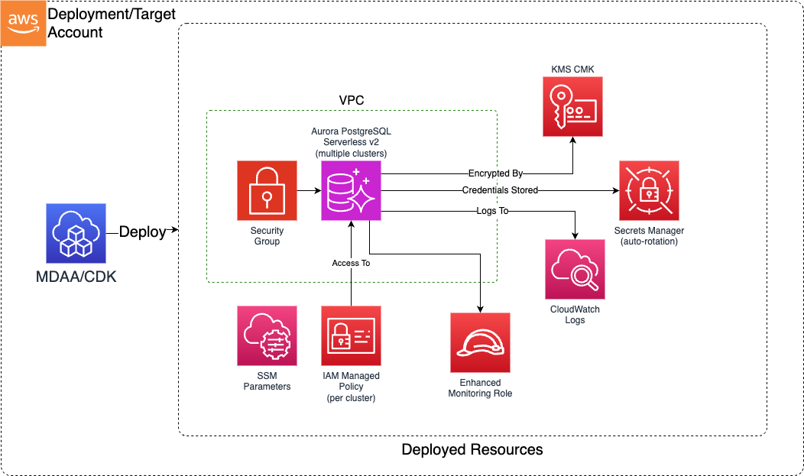

# DataOps Aurora L3 Construct

Deploys compliant Aurora Serverless v2 clusters with enterprise security controls. Currently supports Aurora PostgreSQL, with Aurora MySQL support planned.

## Deployed Resources (per cluster)

**Aurora Serverless v2 Cluster** - Writer instance with configurable reader instances and automatic capacity scaling

**KMS CMK (or project key)** - Customer-managed encryption key shared across all clusters

**VPC Security Group** - Network access control with configurable ingress rules (or imported existing SG)

**IAM Role** - Enhanced Monitoring role for RDS performance insights at 60-second intervals

**Secrets Manager Secret** - Admin credentials with automatic password rotation

**IAM Managed Policy** - Per-cluster access policy granting rds-db:connect, rds:DescribeDBClusters, and Secrets Manager access

**SSM Parameters** - Cluster endpoints published for project integration (when projectName is set)



## Related Modules

- [**DataOps Aurora App**](../../../../apps/dataops/dataops-aurora-app/README.md) — App module that translates YAML config into this L3 construct's props
- [**DataOps Project**](../dataops-project-l3-construct/README.md) — Provides shared KMS key and security groups via project integration

## Security/Compliance

- KMS CMK encryption at rest enforced
- SSL-only connections enforced
- Non-default port required (port obfuscation)
- VPC-bound deployment (no public access)
- IAM database authentication enabled by default
- Enhanced Monitoring enabled (60-second intervals)
- CloudWatch Logs export enabled by default
- Automatic admin password rotation via Secrets Manager
- Backup retention enforced (default 7 days)
- Removal policy set to RETAIN (snapshot on delete)

## Project Integration

When `projectName` is set, the construct uses the shared project KMS key for cluster encryption instead of creating a dedicated key per cluster. Cluster endpoints are published to SSM parameters under the project namespace.

## Usage

```typescript
import { DataopsAuroraL3Construct } from '@aws-mdaa/dataops-aurora-l3-construct';

new DataopsAuroraL3Construct(stack, 'aurora', {
  postgresqlClusters: {
    'analytics-db': {
      engineVersion: '16.6',
      vpcId: 'vpc-12345',
      subnets: [
        { subnetId: 'subnet-aaa', availabilityZone: 'us-east-1a' },
        { subnetId: 'subnet-bbb', availabilityZone: 'us-east-1b' },
      ],
      securityGroupIngress: { ipv4: ['10.0.0.0/16'] },
      port: 15432,
    },
  },
  projectName: 'my-project',
  kmsArn: 'arn:aws:kms:us-east-1:123456789012:key/key-id',
  ...l3ConstructProps,
});
```
