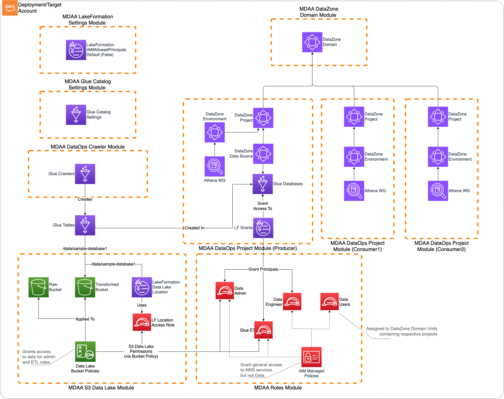

# DataZone Governed Lakehouse

This starter kit deploys an enterprise-ready Governed Data Lakehouse using MDAA's DataZone integration, featuring fine-grained access control and data governance capabilities.

> **[Deployment Instructions](#deployment)**

## Use Cases

- Enterprise data governance and compliance with fine-grained access control
- Multi-team data lake environments with data producer and consumer separation
- Structured data analytics and reporting via Athena
- Data product development and consumption via DataZone portal
- Organizations requiring column and row-level security on data lake resources

## Capabilities

- DataZone domain for data product management, discovery, and subscription
- Fine-grained access control via Lake Formation (database and table-level permissions)
- KMS-encrypted three-zone S3 data lake (raw, transformed, curated)
- Glue Data Catalog with encrypted metadata and automated schema discovery
- IAM roles with separation of duties (data-admin, data-engineer, data-users, glue-etl)
- Multiple DataOps projects for producer and consumer teams

## Architecture

## Deployment

### Prerequisites and Predeployment

1. Authenticate to your target AWS account and region. Ensure the authenticated role has permissions to deploy resources via CDK.
2. [Bootstrap CDK](../../PREDEPLOYMENT.md#single-account-bootstrap) in your target account and region. Deploy in a [region supported by DataZone](https://docs.aws.amazon.com/datazone/latest/userguide/datazone-supported-regions.html).

Additional info: [PREDEPLOYMENT](../../PREDEPLOYMENT.md)

### Configure MDAA

1. Address all TODOs in [`mdaa.yaml`](mdaa.yaml), specifically:
   - Set `organization` to a globally unique name (used in S3 bucket names and all resource prefixes)

2. Address all TODOs in module configs, specifically:
   - CDK Nag suppressions in [`common/governance/roles.yaml`](common/governance/roles.yaml). Uncomment each suppression only after reviewing the associated permissions and confirming they are acceptable for your environment.

### Deploy MDAA

Run the following from the starter kit directory (containing `mdaa.yaml`):

1. Optionally, run `npx @aws-mdaa/cli ls` to understand what stacks will be deployed.

2. Optionally, run `npx @aws-mdaa/cli synth` and review the produced templates.

3. Run `npx @aws-mdaa/cli deploy` to deploy all modules.

Additional info: [DEPLOYMENT](../../DEPLOYMENT.md)

## Next Steps

See [USAGE](USAGE.md) for post-deployment instructions.

## Modules Deployed

| Module | Purpose |
|--------|---------|
| `@aws-mdaa/roles` | IAM roles and policies (data-admin, data-engineer, data-users, glue-etl) |
| `@aws-mdaa/glue-catalog` | Glue Catalog KMS encryption (account-level) |
| `@aws-mdaa/lakeformation-settings` | Lake Formation governance settings (account-level) |
| `@aws-mdaa/datazone` | DataZone domain for data product management |
| `@aws-mdaa/datalake` | KMS keys, S3 buckets, and bucket policies |
| `@aws-mdaa/dataops-project` | Glue databases with Lake Formation access control (x3) |
| `@aws-mdaa/dataops-crawler` | Glue crawlers for schema discovery |

## Troubleshooting

1. **Access Denied when accessing data**: Ensure you're using the correct IAM role (data-admin for write, data-user for read). Verify Lake Formation permissions are configured and data was uploaded with KMS encryption.

2. **DataZone domain not accessible**: Verify the DataZone domain is in "Available" state and that you deployed in a [supported region](https://docs.aws.amazon.com/datazone/latest/userguide/datazone-supported-regions.html).

3. **Glue crawler failures**: Verify S3 bucket permissions and KMS key access. Check that the crawler role has necessary permissions. Monitor CloudWatch logs for details.
