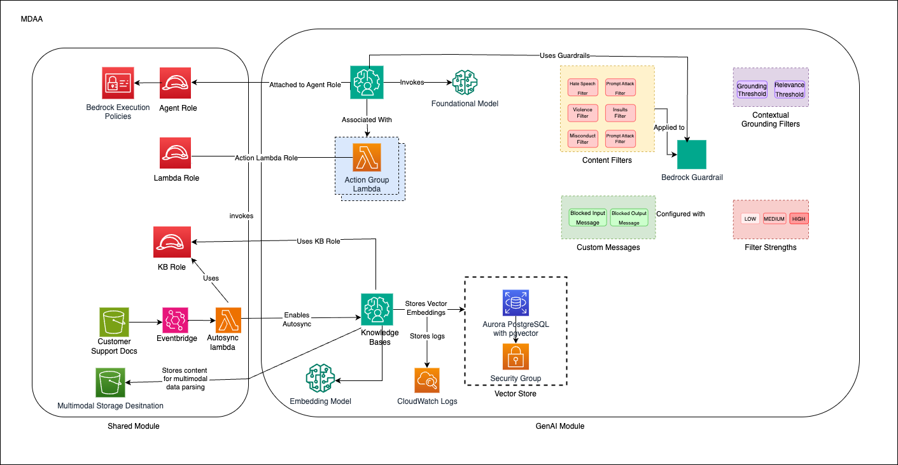

# GenAI Foundation

This starter kit deploys an enterprise-ready Customer Support Agent using Amazon Bedrock, featuring intelligent agents with RAG capabilities, knowledge bases, guardrails, and multi-sync architecture for concurrent document processing.

> **[Deployment Instructions](#deployment)**

## Use Cases

- Customer support agent assistant with natural language interaction
- Knowledge base search and retrieval over internal documents
- Document processing and analysis with RAG (Retrieval Augmented Generation)
- Multi-modal content handling (text and images)

## Capabilities

- Bedrock Agents with custom action groups for customer support
- Knowledge Bases with vector stores for efficient retrieval
- Guardrails for content safety and appropriate responses
- Multi-sync architecture for concurrent file uploads
- KMS-encrypted S3 buckets for knowledge base data sources
- IAM roles with least-privilege Bedrock permissions

## Architecture

## Deployment

### Prerequisites and Predeployment

1. Authenticate to your target AWS account and region. Ensure the authenticated role has permissions to deploy resources via CDK.
2. [Bootstrap CDK](../../PREDEPLOYMENT.md#single-account-bootstrap) in your target account and region.

Additional info: [PREDEPLOYMENT](../../PREDEPLOYMENT.md)

### Configure MDAA

1. Address all TODOs in [`mdaa.yaml`](mdaa.yaml), specifically:
   - Set `organization` to a globally unique name (used in S3 bucket names and all resource prefixes)
   - Set `vpc_id`, `subnet_id_1`, `subnet_id_2`, `subnet_id_3` to your VPC/subnet IDs
   - Set `llm_model` to your chosen Bedrock model ID or inference profile ARN
   - Set `kb_embedding_model` and `kb_parsing_model`

2. Address all TODOs in module configs, specifically:
   - CDK Nag suppressions in [`roles.yaml`](roles.yaml). Uncomment each suppression only after reviewing the associated permissions and confirming they are acceptable for your environment.

### Deploy MDAA

Run the following from the starter kit directory (containing `mdaa.yaml`):

1. Optionally, run `npx @aws-mdaa/cli ls` to understand what stacks will be deployed.

2. Optionally, run `npx @aws-mdaa/cli synth` and review the produced templates.

3. Run `npx @aws-mdaa/cli deploy` to deploy all modules.

Additional info: [DEPLOYMENT](../../DEPLOYMENT.md)

## Next Steps

See [USAGE](docs/USAGE.md) for post-deployment instructions including model configuration, document upload, and agent testing.

## Modules Deployed

| Module | Purpose |
|--------|---------|
| `@aws-mdaa/roles` | IAM roles (data-admin, agent-execution, kb-execution, agent-lambda, kb-sync-lambda) |
| `@aws-mdaa/datalake` | KMS-encrypted S3 buckets for knowledge base data sources |
| `@aws-mdaa/bedrock-builder` | Bedrock Agents, Knowledge Bases, Guardrails, and Lambda action groups |

## Troubleshooting

1. **Access Denied when calling Bedrock**: Verify the `llm_model` in context values is correct. For cross-region inference, use the inference profile ARN. Ensure the agent execution role has the necessary Bedrock permissions.

2. **Knowledge Base ingestion failures**: Verify S3 bucket permissions and KMS key access. Check that documents are uploaded with proper encryption. Monitor CloudWatch logs for detailed error messages.

3. **Agent not responding**: Ensure the agent is in "Prepared" state. Check guardrail configurations. Verify Lambda function permissions for action groups.
