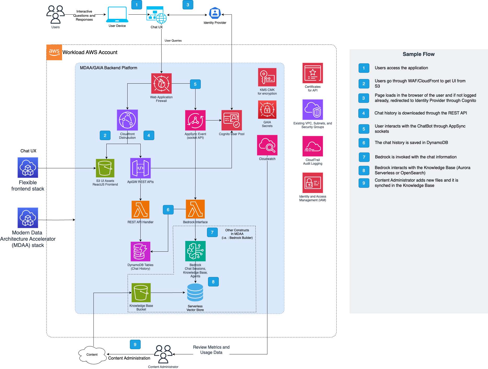

# GAIA Chatbot Starter Kit

This starter kit deploys a production-ready GenAI chatbot backend using Amazon Bedrock Knowledge Bases, Guardrails, and serverless APIs. You provide a frontend application and documents for the knowledge base.

> **[Deployment Instructions](#deployment)**

## Use Cases

- RAG-powered chatbot with enterprise authentication
- Document Q&A over internal knowledge bases (PDF, TXT, MD, HTML, DOCX)
- Real-time streaming chat via WebSocket (AppSync Events)
- Content-filtered AI responses with Bedrock Guardrails

## Capabilities

- Cognito User Pool with email/password or enterprise SSO authentication
- Bedrock Knowledge Base with OpenSearch Serverless vector store
- Bedrock Guardrails for content filtering and PII protection
- KMS-encrypted S3 data lake for document storage
- REST API (API Gateway) for session management, feedback, and admin operations
- WebSocket API (AppSync Events) for real-time chat streaming
- VPC-deployed Lambda functions for serverless compute
- CloudFront CDN serving `aws-exports.json` configuration
- WAF web application firewall (optional)

## Architecture

## Deployment

### Prerequisites and Predeployment

1. Authenticate to your target AWS account and region. Ensure the authenticated role has permissions to deploy resources via CDK.
2. [Bootstrap CDK](../../PREDEPLOYMENT.md#single-account-bootstrap) in your target account and region.
3. **If deploying outside us-east-1**: also bootstrap CDK in **us-east-1** in the same account. CloudFront WAF resources must be deployed in us-east-1; the module creates a cross-region stack there automatically via the `additional_stacks` configuration.
4. Provision a VPC with private subnets and a NAT Gateway (required — AppSync Events has no VPC endpoint).
5. Enable Bedrock model access in the AWS console for your target region.

Additional info: [PREDEPLOYMENT](../../PREDEPLOYMENT.md)

### Configure MDAA

1. Address all TODOs in [`mdaa.yaml`](mdaa.yaml), specifically:
   - Set `organization` to a globally unique name
   - Set `context` values:
     - `vpc_id` — VPC ID
     - `app_subnet_id_1`, `app_subnet_id_2` — private subnets with NAT Gateway route
     - `data_subnet_id_1`, `data_subnet_id_2` — data subnets (can be same as app subnets)
     - `inference_model_arn` — Bedrock model ARN or inference profile ARN
     - `embedding_model` — embedding model ID for knowledge base
     - `waf_allowed_cidrs` — IP allowlist (your IP, IPv6, NAT Gateway IP)

2. Address all TODOs in module configs, specifically:
   - CDK Nag suppressions in [`config/roles.yaml`](config/roles.yaml). Uncomment each suppression only after reviewing the associated permissions and confirming they are acceptable for your environment.

### Deploy MDAA

Run the following from the starter kit directory (containing `mdaa.yaml`):

1. Optionally, run `npx @aws-mdaa/cli ls` to understand what stacks will be deployed.

2. Optionally, run `npx @aws-mdaa/cli synth` and review the produced templates.

3. Run `npx @aws-mdaa/cli deploy` to deploy all modules.

Additional info: [DEPLOYMENT](../../DEPLOYMENT.md)

## Next Steps

See [USAGE](docs/USAGE.md) for post-deployment instructions.

## Modules Deployed

| Module | Purpose |
|--------|---------|
| `@aws-mdaa/roles` | IAM roles and policies |
| `@aws-mdaa/datalake` | KMS-encrypted S3 buckets for document storage |
| `@aws-mdaa/bedrock-builder` | Bedrock Knowledge Base and Guardrails |
| `@aws-mdaa/gaia-v2` | Chatbot backend (API Gateway, Lambda, Cognito, CloudFront, AppSync, WAF) |

## Troubleshooting

1. **403 Forbidden on Cognito login**: Ensure `cognitoAddAsIdentityProvider: true` is set in `gaia.yaml`. If WAF is enabled, verify your IPv4 and IPv6 addresses are in the allowlist.

2. **Chat messages hang / no response**: WAF is blocking Lambda responses through AppSync. Add your NAT Gateway's public IP to `waf_allowed_cidrs` in `mdaa.yaml`.

3. **Lambda timeouts / connection errors**: Subnets must have a route to a NAT Gateway. AppSync Events has no VPC endpoint, so NAT Gateway is mandatory.

4. **Knowledge base not finding documents**: Verify documents are uploaded to the correct S3 prefix (`data/bedrock-knowledge-base/`) and sync the knowledge base in the Bedrock console.

5. **"CloudFront WAF requires a cross-region stack when your primary region is not us-east-1"**: The `gaia-chatbot` module deploys a CloudFront distribution with a WAF WebACL. WAF for CloudFront must reside in us-east-1. If your deployment region is not us-east-1, ensure that `additional_stacks: [{region: us-east-1}]` is present on the `gaia-chatbot` module in `mdaa.yaml` and that you have bootstrapped CDK in us-east-1 (see Prerequisites step 3).
