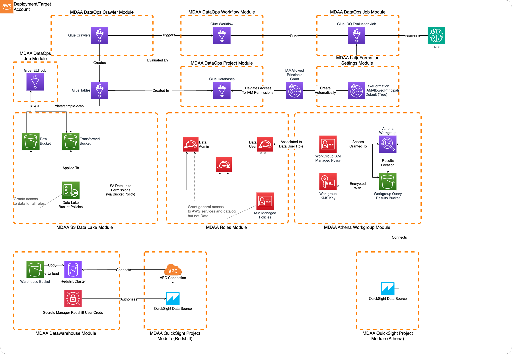

# Lakehouse Analytics

A complete analytics lakehouse on AWS — S3 data lake, Glue cataloguing and ETL, data quality enforcement, Athena and Redshift querying, and QuickSight BI — deployable end-to-end with a single `npx @aws-mdaa/cli deploy`.

> **[Deployment Instructions](#deployment)**

## Use Cases

- Data needs to flow through ingestion, processing, quality validation, and consumption layers.
- Analytics are consumed via Athena, Redshift, and QuickSight.
- Data quality enforcement and ETL workflows are required.
- Fine-grained access controls and governance are needed.
- You want a validated, end-to-end reference covering all six DIW Data Foundations capabilities (Ingestion/Storage, Cataloguing, Processing, Querying, Warehousing, Consumption/BI) plus Governance.

## Capabilities

- **Storage** — S3 data lake with `raw` and `transformed` buckets, KMS-encrypted, with coarse-grained access via bucket policies.
- **Cataloguing** — KMS-encrypted Glue Data Catalog, Lake Formation settings, a DataOps project with a sample Glue database, and a Glue crawler.
- **Processing** — Glue ETL job (sample PySpark script) plus a Glue Data Quality ruleset, DQ evaluation job, and a workflow that runs DQ after the crawler.
- **Querying** — Athena workgroup over the data lake.
- **Warehousing** — Redshift cluster (multi-AZ, cross-region snapshot copy).
- **Consumption/BI** — QuickSight account, VPC connection, and data sources for both Athena and Redshift.
- **Governance** — IAM roles (`data-admin`, `data-user`, `glue-etl`), an S3 audit bucket, and a CloudTrail audit trail.

## Architecture



## Deployment

### Prerequisites and Predeployment

1. Authenticate to your target AWS account and region. Ensure the authenticated role has permissions to deploy resources via CDK.
2. [Bootstrap CDK](../../PREDEPLOYMENT.md#single-account-bootstrap) in your target account and region.
3. Provision a **VPC with at least 3 subnets across 3 Availability Zones** (required for Redshift multi-AZ and the QuickSight VPC connection).

Additional info: [PREDEPLOYMENT](../../PREDEPLOYMENT.md)

### Configure MDAA

1. Address all TODOs in [`mdaa.yaml`](mdaa.yaml), specifically:
   - Set `organization` to a globally unique name (used in the naming of all deployed resources, some of which are globally named such as S3 buckets).
   - Set the `context` values for your environment: `vpc_id`, `subnet_id_1`, `subnet_id_2`, `subnet_id_3`, `notification_email`, `vpc_cidr`, `backup_region`, `qs_identity_region`.
   - Optionally override `qs_readers_group` and `qs_authors_group`, which default to `readers` and `authors`.
   - Optionally set `permissions_boundary_name` to apply an IAM permissions boundary to all roles.
   - Optionally comment out the `glue-catalog` module if another MDAA deployment already manages the account-level Glue Catalog encryption.

2. Address all TODOs in module configs, specifically:
   - CDK Nag suppressions in [`governance/roles.yaml`](governance/roles.yaml). Uncomment each suppression only after reviewing the associated permissions and confirming they are acceptable for your environment.

### Deploy MDAA

Run the following from the starter kit directory (containing `mdaa.yaml`):

1. Optionally, run `npx @aws-mdaa/cli ls` to understand what stacks will be deployed.
2. Optionally, run `npx @aws-mdaa/cli synth` and review the produced templates.
3. Run `npx @aws-mdaa/cli deploy` to deploy all modules. The default path uses IAM-based authentication for the QuickSight Redshift data source and requires no manual console steps.

Additional info: [DEPLOYMENT](../../DEPLOYMENT.md)

## Next Steps

After deploying, see [`USAGE.md`](USAGE.md) for what got deployed, where to find it, how to add QuickSight users, and how to load sample data and run the pipeline.

## Modules Deployed

| Module | Purpose |
|--------|---------|
| `quicksight-account` | Provisions the QuickSight account, resource-access service role, VPC connection security group, and the `readers`/`authors` groups. Deployed first so the service role exists before later modules reference it. |
| `roles` | Creates the `data-admin`, `data-user`, and `glue-etl` IAM roles with least-privilege policies. |
| `datalake` | Deploys the KMS-encrypted `raw` and `transformed` S3 buckets and bucket policies. |
| `glue-catalog` | Enforces KMS encryption on the account-level Glue Data Catalog. |
| `lakeformation-settings` | Configures Lake Formation administration mode and IAM-allowed-principals default for new databases/tables. |
| `athena` | Creates an Athena workgroup for querying the data lake. |
| `redshift` | Deploys a multi-AZ Redshift cluster with cross-region snapshot copy. |
| `audit` | Creates a secure S3 bucket for use as a CloudTrail / S3 Inventory target. |
| `audit-trail` | Creates a secure S3-based CloudTrail audit trail. |
| `example-project` | Creates a DataOps project with a sample Glue database and Lake Formation grants. |
| `example-crawler` | Creates a Glue crawler that catalogs the sample data in the transformed bucket. |
| `example-data-quality` | Creates Glue Data Quality rulesets for validating data completeness and integrity. |
| `etl-job` | Deploys a Glue ETL job for data transformation (sample PySpark script). |
| `dq-job` | Deploys a Glue DQ evaluation job using the bundled `dq-main.py` script. |
| `dq-workflow` | Creates a Glue workflow that triggers the DQ job after the crawler completes. |
| `quicksight-athena` | Creates a QuickSight data source over the Athena workgroup and attaches the matching S3/KMS grants to the QuickSight resource-access role. |
| `sg-rules` | Wires the QuickSight↔Redshift security group connectivity (`@aws-mdaa/ec2` module) by adding rules to the pre-existing QuickSight and Redshift security groups. |
| `quicksight-redshift` | Creates a QuickSight data source over the Redshift cluster. Reaches the cluster via the connectivity wired by `sg-rules`. |

## Troubleshooting

### QuickSight data sources do not appear in the console

The deploy creates the `readers` and `authors` QuickSight groups and grants them access, but it does not add any members — so the data sources are invisible until you join a group. Add your QuickSight user to a group (see [`USAGE.md`](USAGE.md)). The data sources appear under **Datasets → New dataset → FROM EXISTING DATA SOURCES**, not as a browsable top-level page. Group membership can take a few minutes to propagate; if a data source still does not appear, refresh, or grant your user direct access via the data source's **Share** / permissions.

### QuickSight identity region mismatch

QuickSight group and folder ARNs must use the identity region (where QuickSight was originally subscribed), set via `qs_identity_region` in [`mdaa.yaml`](mdaa.yaml). If this does not match where QuickSight was subscribed, group and folder permissions fail silently.

### Redshift data source transient error on first create

If the Redshift data source hits a transient error on first create, re-run the deploy once.

### Using Secrets Manager authentication for the Redshift data source (two-pass deploy)

The default deploy uses IAM-based authentication and is fully automated. To use Secrets Manager authentication instead, a two-pass deploy is required because enabling QuickSight's access to Secrets Manager can only be done in the console (no API). The console can only manage the `aws-quicksight-service-role-v0` role while it has no policies attached, so you deploy with the role bare, do the console enablement, then deploy the data sources.

1. In [`governance/quicksight-account.yaml`](governance/quicksight-account.yaml) comment out `resourceAccessRolePermissions`. In [`data/redshift.yaml`](data/redshift.yaml) uncomment `databaseUsers`. In [`consumption/quicksight-redshift.yaml`](consumption/quicksight-redshift.yaml) comment out `iamParameters` and uncomment `secretsManager`.

2. Deploy everything except the consumption data sources:

   ```bash
   npx @aws-mdaa/cli deploy -d governance,data,dataops
   ```

3. Open the QuickSight console **AWS resources** page (account name → **Manage account** → **AWS resources**, or **Permissions → AWS resources** in the left sidebar). On that page, enable **Athena** (choose **Connect both** and select the data lake and Athena results buckets), **Redshift**, and **Secrets Manager** (select the `serviceuserquicksight` secret). Resolve the bucket names from SSM:

   ```bash
   ORG="<organization>"   # e.g. lakehouse-analytics-us-east-1-123456789012
   aws ssm get-parameters --region <region> \
     --names \
       "/$ORG/data/datalake/bucket/raw/name" \
       "/$ORG/data/datalake/bucket/transformed/name" \
       "/$ORG/data/athena/bucket/name" \
     --query 'Parameters[].Value' --output text
   ```

4. Deploy the consumption data sources:

   ```bash
   npx @aws-mdaa/cli deploy -d consumption
   ```
