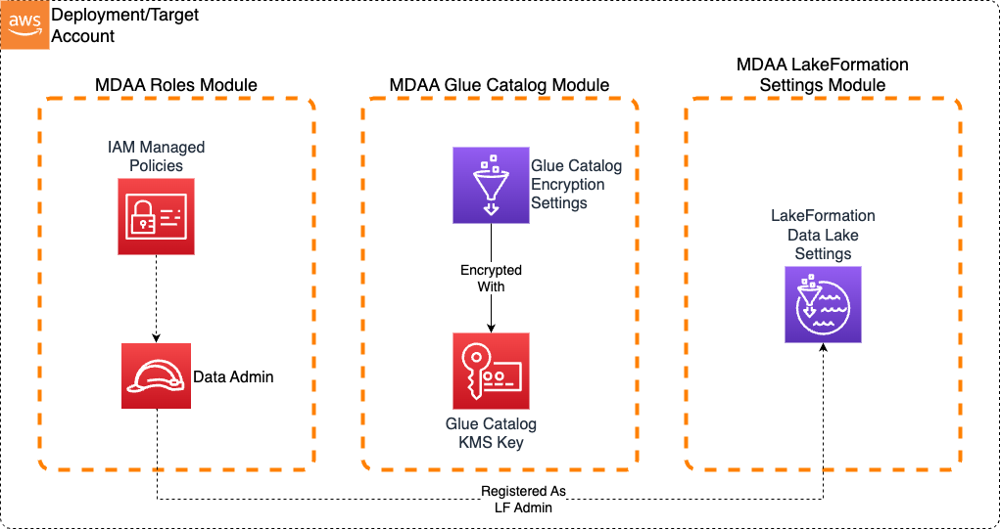

# Minimal

This starter kit deploys the foundational governance layer required by all MDAA architectures: IAM roles, Glue Catalog encryption, and LakeFormation settings. Use this as a starting point when you want to build your own architecture from scratch.

> **[Deployment Instructions](#deployment)**

## Use Cases

- Starting a new MDAA project from scratch and adding modules incrementally
- Establishing governance foundations before deciding on a specific architecture
- Learning MDAA with the simplest possible deployment

## Capabilities

- IAM role generation with CDK Nag compliance
- Glue Catalog KMS encryption (account-level)
- LakeFormation settings delegating access control to IAM (account-level)
- Resource tagging for cost allocation and operational governance

## Architecture

## Deployment

### Prerequisites and Predeployment

1. Authenticate to your target AWS account and region. Ensure the authenticated role has permissions to deploy resources via CDK.
2. [Bootstrap CDK](../../PREDEPLOYMENT.md#single-account-bootstrap) in your target account and region.

Additional info: [PREDEPLOYMENT](../../PREDEPLOYMENT.md)

### Configure MDAA

1. Address all TODOs in [`mdaa.yaml`](mdaa.yaml), specifically:
   - Set `organization` to a globally unique name

2. Address all TODOs in module configs, specifically:
   - CDK Nag suppressions in [`roles.yaml`](govern/roles.yaml). Uncomment each suppression only after reviewing the associated permissions and confirming they are acceptable for your environment.

### Deploy MDAA

Run the following from the starter kit directory (containing `mdaa.yaml`):

1. Optionally, run `npx @aws-mdaa/cli ls` to understand what stacks will be deployed.

2. Optionally, run `npx @aws-mdaa/cli synth` and review the produced templates.

3. Run `npx @aws-mdaa/cli deploy` to deploy all modules.

Additional info: [DEPLOYMENT](../../DEPLOYMENT.md)

## Next Steps

See [USAGE.md](USAGE.md) for post-deployment verification and next steps.

Once deployed, extend your architecture by adding modules from the [available modules](../../README.md#available-modules) catalog. Common next steps:

- Add `@aws-mdaa/datalake` for S3 storage with encryption and access policies
- Add `@aws-mdaa/athena-workgroup` for SQL querying
- Add `@aws-mdaa/dataops-project` for ETL pipeline infrastructure

## Modules Deployed

| Module | Purpose |
|--------|---------|
| `@aws-mdaa/roles` | IAM roles and policies for the data environment |
| `@aws-mdaa/glue-catalog` | Glue Catalog KMS encryption (account-level) |
| `@aws-mdaa/lakeformation-settings` | LakeFormation IAM delegation (account-level) |

## Troubleshooting

1. **LakeFormation settings conflict**: If LakeFormation settings have already been configured in the account (manually or by another deployment), the `lakeformation-settings` module may fail. Remove existing LakeFormation data lake administrators via the AWS Console before deploying.
